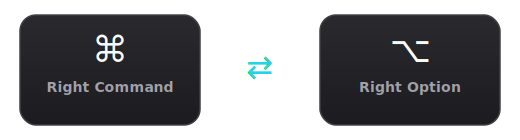

# Swap Right Command and Option on macOS

Swaps **Right Command** and **Right Option** on macOS. Applied immediately, persists across reboots.

<p align="center">
  
</p>

Especially useful for **Polish Mac users** — Polish diacritics (ą, ę, ś, ć, ż, ź, ó, ł, ń) are typed with Right Option + letter. On many external keyboards, Right Option is where Right Command sits on the MacBook, making Polish characters awkward to type. This swap fixes that.

## One-liner install

```bash
curl -fsSL https://nikoro.github.io/swap-right-command-and-option/install.sh | bash
```

This will:
1. Download the LaunchAgent plist to `~/Library/LaunchAgents/`
2. Load it immediately (keys are swapped right away)
3. Register it to run on every login

## Manual install

### 1. Create the plist file

Save the following as `~/Library/LaunchAgents/com.local.swap-right-command-and-option.plist`:

```xml
<?xml version="1.0" encoding="UTF-8"?>
<!DOCTYPE plist PUBLIC "-//Apple//DTD PLIST 1.0//EN" "http://www.apple.com/DTDs/PropertyList-1.0.dtd">
<plist version="1.0">
<dict>
    <key>Label</key>
    <string>com.local.swap-right-command-and-option</string>
    <key>ProgramArguments</key>
    <array>
        <string>/usr/bin/hidutil</string>
        <string>property</string>
        <string>--set</string>
        <string>{"UserKeyMapping":[{"HIDKeyboardModifierMappingSrc":0x7000000e7,"HIDKeyboardModifierMappingDst":0x7000000e6},{"HIDKeyboardModifierMappingSrc":0x7000000e6,"HIDKeyboardModifierMappingDst":0x7000000e7}]}</string>
    </array>
    <key>RunAtLoad</key>
    <true/>
</dict>
</plist>
```

### 2. Load the agent

```bash
launchctl bootstrap gui/$(id -u) ~/Library/LaunchAgents/com.local.swap-right-command-and-option.plist
```

The swap takes effect immediately — no restart needed.

## Uninstall

```bash
launchctl bootout gui/$(id -u) ~/Library/LaunchAgents/com.local.swap-right-command-and-option.plist
rm ~/Library/LaunchAgents/com.local.swap-right-command-and-option.plist
```

Then log out and back in (or restart) to restore the default key mapping.

## How it works

macOS provides [`hidutil`](https://developer.apple.com/library/archive/technotes/tn2450/_index.html) to remap keyboard keys at a low level. The plist registers a LaunchAgent that runs `hidutil property --set` on every login, swapping these two keys:

| Key | HID Usage ID |
|---|---|
| Right Command | `0x7000000e7` |
| Right Option | `0x7000000e6` |

The mapping is bidirectional — each key sends the other's code.
